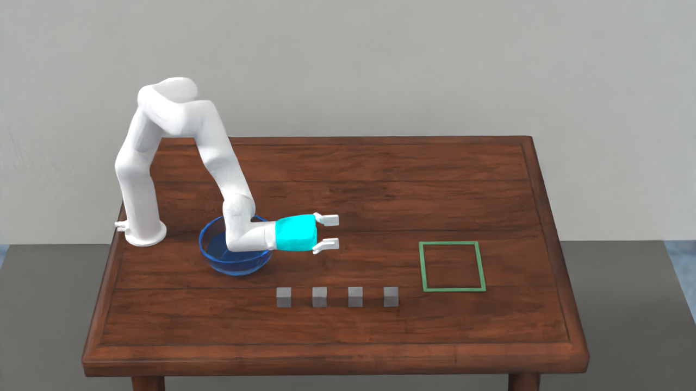

# Genesis Scene Kit

一套从我们现有 benchmark 场景生成流程中整理出的 Genesis 场景工具。重点是稳定复用严格 RayTracer、相机配置、RobotSmith 单臂资产、场景输出和 manifest，而不是把每一道题的多代实验脚本原样堆进仓库。



## 你会得到什么

- 明确的 `raytracer` / `rasterizer` 两种模式，正式渲染不会静默降级。
- 项目内独立的 Genesis、CUDA、OptiX 和 LuisaRender 缓存目录。
- 可复用桌面、墙面、目标区、透明碗、水面和同外观方块。
- 可选 RobotSmith xArm7 + parallel gripper。
- 每次运行输出 RGB、GIF 和记录 renderer/camera/runtime/assets 的 JSON manifest。

## Windows 快速部署

推荐 Python 3.11、NVIDIA GPU 和较新的显卡驱动。在 PowerShell 中运行：

```powershell
git clone https://github.com/chengshenge/Genesis_scene.git
cd Genesis_scene

py -3.11 -m venv .venv
Set-ExecutionPolicy -Scope Process Bypass
.\.venv\Scripts\Activate.ps1
python -m pip install --upgrade pip setuptools wheel

# 按本机驱动选择合适的 PyTorch CUDA wheel；团队当前环境使用 cu128。
python -m pip install torch torchvision --index-url https://download.pytorch.org/whl/cu128
python -m pip install -e ".[dev]"

# PyPI 的 genesis-world 不包含可直接使用的 LuisaRenderPy。
# 下面的脚本会检出我们验证过的 Genesis commit，并编译 Windows/CUDA RayTracer。
.\scripts\setup_raytracer_windows.ps1

git clone https://github.com/UMass-Embodied-AGI/RobotSmith .external/RobotSmith
$env:ROBOTSMITH_ROOT = (Resolve-Path .external/RobotSmith).Path
$env:GENESIS_SOURCE_ROOT = (Resolve-Path .external/Genesis).Path
$env:LUISA_RENDER_BUILD_BIN = (Resolve-Path .external/Genesis/genesis/ext/LuisaRender/build-win-cuda/bin/Release).Path

python scripts/check_environment.py --strict-raytracer
python examples/raytraced_tabletop.py --renderer raytracer --backend gpu --spp 16
```

输出在 `outputs/raytraced_tabletop/`：

```text
scene_rgb.png
scene_preview.gif
scene_manifest.json
generated_assets/open_bowl.obj
```

首次 RayTracer 运行需要编译 Genesis kernel、shader 并建立缓存；我们在 Windows/RTX 3060 Ti 上的第一次最小 smoke test 约为 5 分钟，后续会复用缓存。先用较小图像测试更省时间：

```powershell
python examples/raytraced_tabletop.py --no-robot --renderer raytracer --backend gpu --width 320 --height 180 --spp 1 --settle-steps 1
```

## 没有 RobotSmith 时先测试基础场景

```powershell
python examples/raytraced_tabletop.py --no-robot --renderer raytracer --backend gpu --spp 4
```

若只想检查几何、相机和物体位置，可明确选择 rasterizer：

```powershell
python examples/raytraced_tabletop.py --no-robot --renderer rasterizer --backend gpu --width 640 --height 360
```

Rasterizer 输出只用于调试，不应作为最终 benchmark RGB。

## Linux

安装命令相同，只需将虚拟环境激活替换为：

```bash
python3.11 -m venv .venv
source .venv/bin/activate
```

然后安装与你的驱动匹配的 PyTorch CUDA wheel，再执行 `pip install -e ".[dev]"`。RayTracer 还需要递归 clone Genesis，并按 `.external/Genesis/genesis/ext/LuisaRender/BUILD.md` 编译 LuisaRender；完成后设置：

```bash
export GENESIS_SOURCE_ROOT="$PWD/.external/Genesis"
export LUISA_RENDER_BUILD_BIN="$GENESIS_SOURCE_ROOT/genesis/ext/LuisaRender/build/bin"
```

## 新建一个场景

1. 复制 `examples/raytraced_tabletop.py`。
2. 在 scene build 之前添加资产、材质、位置与碰撞体。
3. 调整 `CameraSpec`，先用低分辨率和低 SPP 验证构图。
4. 正式生成时提高 SPP，并检查 `scene_manifest.json` 中 `renderer_effective`、`rasterizer_fallback_used` 和运行环境。
5. 不要提交下载的 BlenderKit/Objaverse 二进制资产；在 `docs/ASSETS.md` 记录资产 ID、来源和许可证。

更完整的模块边界见 [docs/PIPELINE.md](docs/PIPELINE.md)，外部资产约定见 [docs/ASSETS.md](docs/ASSETS.md)。

## 当前限制

- Genesis RayTracer 依赖单独编译的 LuisaRender 与 CUDA/OptiX；普通 `pip install genesis-world` 只能满足 Genesis Python 依赖，不能单独完成 RayTracer 部署。
- 示例中的水面是可见的透明 surface，不是完整流体求解器。
- RobotSmith 和 BlenderKit 资产各自受其上游许可证约束，本仓库不重新分发它们。
- 仓库当前未声明开源许可证；组内外分发前请由维护者补充合适的 `LICENSE`。
